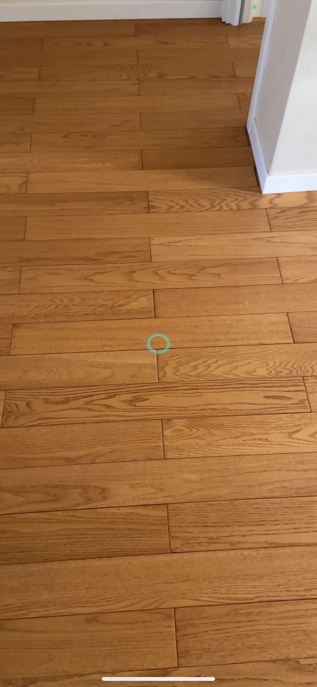
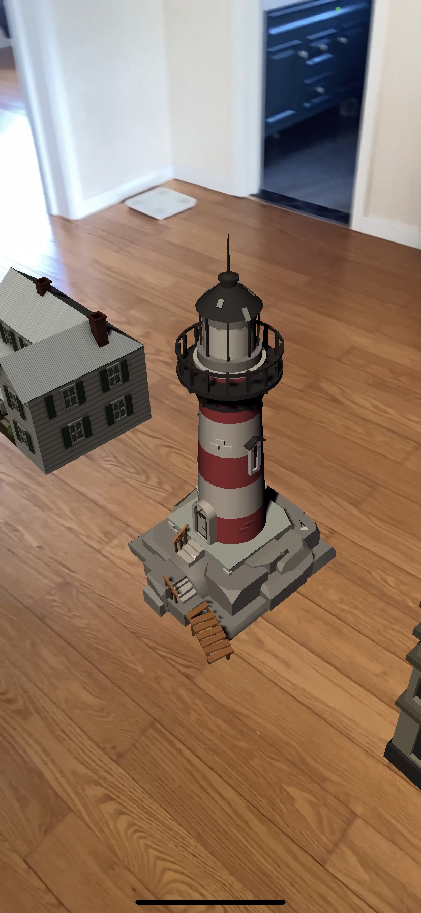
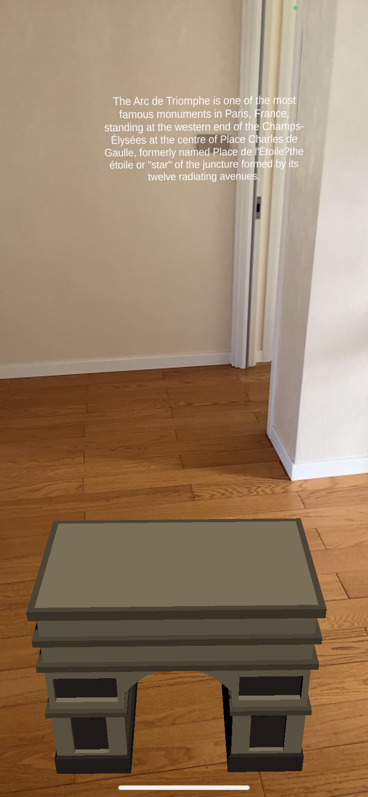

# Unity-ARFoundation-echoAR-demo-Traveling-Demo
A traveling Demo created with Unity, AR Foundation, and echoAR.

## Register
If you don't have an echoAR API key yet, make sure to register for FREE at [echoAR](https://console.echoar.xyz/#/auth/register).

## Setup
* Create a new Unity project.
* Clone the [Unity-ARFoundation-echoAR](https://github.com/echoARxyz/Unity-ARFoundation-echoAR) sample code.
* Clone this repository for prefabs,scenes and custom scripts.
* Follow the instructions on our [doumention page](https://docs.echoar.xyz/unity/adding-ar-capabilities) to [set your API key](https://docs.echoar.xyz/unity/adding-ar-capabilities#3-set-you-api-key).
* Set your echoAR API key in the echoAR prefab
* Add the models from the models folder to the echoAR console
* For each model, add the corresponding metadata from the metadata folder on the echoAR console
* Overwrite the existing echoAR/CustomBehaviour.cs script with the new _CustomBehaviour.cs_ file

## Run
* [Build and run the AR application](https://docs.echoar.xyz/unity/adding-ar-capabilities#4-build-and-run-the-ar-application).

## Learn more
Refer to our [documentation](https://docs.echoar.xyz/unity/) to learn more about how to use Unity, AR Foundation, and echoAR.

## Support
Feel free to reach out at [support@echoAR.xyz](mailto:support@echoAR.xyz) or join our [support channel on Slack](https://join.slack.com/t/echoar/shared_invite/enQtNTg4NjI5NjM3OTc1LWU1M2M2MTNlNTM3NGY1YTUxYmY3ZDNjNTc3YjA5M2QyNGZiOTgzMjVmZWZmZmFjNGJjYTcxZjhhNzk3YjNhNjE). 

## Screenshots

You will see a blue indicator that shows the surface your camera is pointing at. Tap anywhere on the screen to place the buildings.

You will see the buildings after tapping the screen. The indicator will be gone, and you can view description by tapping any object. 

The description then will be shown above the building. Tap again to hide.
## Todo
- Use UI text to display description instead of MeshText
- Fix box colliders